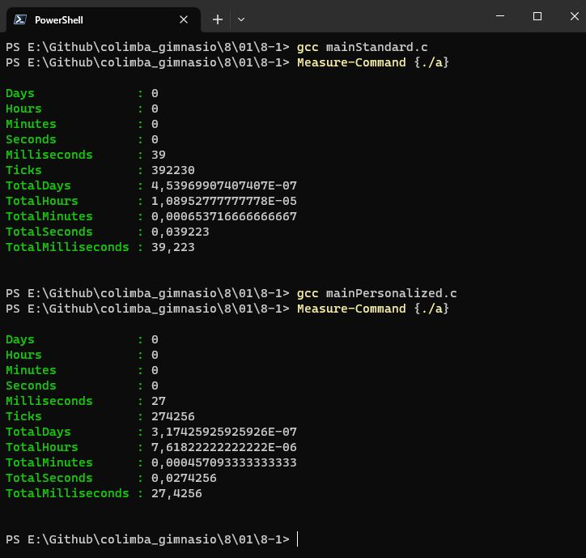

# General observations Excercise 8-1

This program will merge two texts into one.
There are two version of the program one using starndard library functions, and the other uses unix system functions as requested in the excercise instructions.

1. **The Standard program** is named **_mainStandard.c_** and will merget text1.txt and text2.txt into text3Standard.txt

   In this program, the functions fopen, fclose, fgetc, fputc, fprintf, and ferror are parte of the stdio.h library. The exit function is part of the stdlib.h library.

2. **The System** program is named **_mainSystem.c_** and will merget text1.txt and text2.txt into text3System.txt

   In this program, the functions open, read, write, and close are standard UNIX system calls.

**_text1.txt_** and **_text2.txt_** are the same files used on previous chapter.

There are no terminal output, since the program "output" is infact the contructions of the text3 file.

**In Conclusion,**
The program using Standard libraries functions takes more time (39,223ms) than the program using unix function operators (27,4256ms). Aproximatly 40% faster.

<br> </br>

# Questions

- none

---

<br> </br>

 (\*)

> Windows Powershell Terminal

```
PS E:\Github\colimba_gimnasio\8\01\8-1> gcc mainStandard.c
PS E:\Github\colimba_gimnasio\8\01\8-1> Measure-Command {./a}

Days              : 0
Hours             : 0
Minutes           : 0
Seconds           : 0
Milliseconds      : 39
Ticks             : 392230
TotalDays         : 4,53969907407407E-07
TotalHours        : 1,08952777777778E-05
TotalMinutes      : 0,000653716666666667
TotalSeconds      : 0,039223
TotalMilliseconds : 39,223


PS E:\Github\colimba_gimnasio\8\01\8-1> gcc mainSystem.c
PS E:\Github\colimba_gimnasio\8\01\8-1> Measure-Command {./a}

Days              : 0
Hours             : 0
Minutes           : 0
Seconds           : 0
Milliseconds      : 27
Ticks             : 274256
TotalDays         : 3,17425925925926E-07
TotalHours        : 7,61822222222222E-06
TotalMinutes      : 0,000457093333333333
TotalSeconds      : 0,0274256
TotalMilliseconds : 27,4256


PS E:\Github\colimba_gimnasio\8\01\8-1>

```

(\*) mainSystem.c = mainPersonalized.c, its the same program. I renamed the program to mainSystem after reviewing the excercise because it is a much more appropiate name than mainPersonalized

Last but not least, the a.exe file is the executable made after compiling in windows via the powershell terminal using gcc command.
